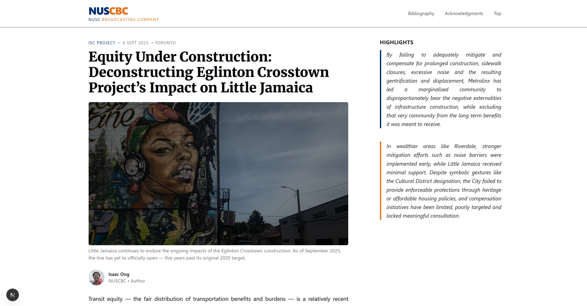

# GEx Toronto 2025 ISC submission

A single-article news feature built with **Next.js**, **TypeScript**, and **Tailwind CSS**.  
This project was created to showcase a long-form article with responsive typography, a sidebar image gallery, and a lightbox viewer.

<p align="center">
  <a href="https://gex-toronto-isc.vercel.app/">Live Demo</a> •
  <a href="LICENSE">MIT License</a>
</p>

<p align="center">
  <em>Single-article news feature with responsive typography, a sidebar image gallery, and a lightbox viewer.</em>
</p>

<p align="center">
  
  
</p>

## Live Demo

Visit the website here: <a href="https://gex-toronto-isc.vercel.app/">https://gex-toronto-isc.vercel.app/</a>

## Screenshots

### Desktop Layout



### Mobile Layout


---

## Features

- **Next.js App Router** with `app/` directory
- **Sidebar gallery** with image lightbox
- **Deployed on Vercel**

---

## Project Structure

```
app/
 ├─ layout.tsx        # Root layout (header, footer, metadata)
 ├─ page.tsx          # Main article page
 ├─ globals.css       # Global styles
components/
 ├─ Lightbox.tsx      # Image modal viewer
 ├─ SidebarGallery.tsx # Thumbnail grid for images
 ├─ SidebarSection.tsx # Sidebar content section
public/
 ├─ images/           # Static images
```
---

## Getting Started

### 1. Clone the repo

```bash
git clone https://github.com/<your-username>/<your-repo>.git
cd <your-repo>
```

### 2. Install dependencies

```bash
npm install
```

### 3. Run development server

```bash
npm run dev
```
Open <a href="http://localhost:3000">http://localhost:3000</a> in your browser.

### 4. Build for production

```bash
npm run build
npm start
```

---

## Deployment

This project is deployed with <a href="https://vercel.com/">Vercel</a>.

Every push to the `main` branch triggers an automatic rebuild and redeploy.  
You can also deploy manually via CLI:

```bash
npm install -g vercel
vercel
```

---

## Tech Stack

- <a href="https://nextjs.org/">Next.js</a> – React framework
- <a href="https://www.typescriptlang.org/">TypeScript</a> – Static typing
- <a href="https://tailwindcss.com/">Tailwind CSS</a> – Utility-first CSS
- <a href="https://vercel.com/">Vercel</a> – Deployment platform

---

## License

This project is licensed under the MIT License.  
See <a href="LICENSE">LICENSE</a> for details.

---

## Credits

Created by **Isaac Ong**.  
Special thanks to the Toronto GEx 2025 cohort.
